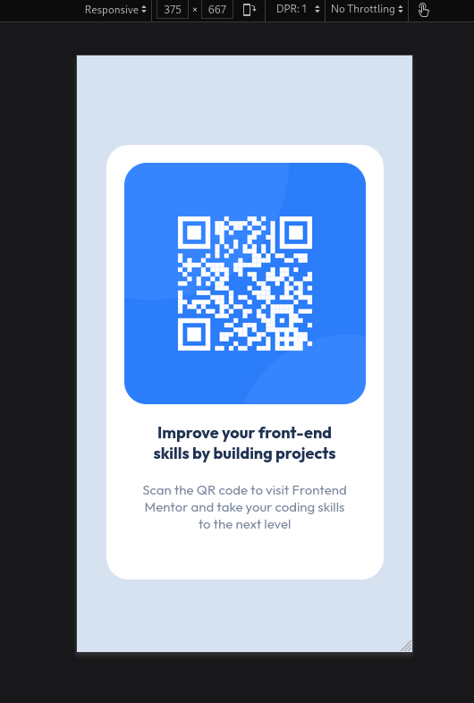

# Frontend Mentor - QR code component solution

This is a solution to the [QR code component challenge on Frontend Mentor](https://www.frontendmentor.io/challenges/qr-code-component-iux_sIO_H). Frontend Mentor challenges help you improve your coding skills by building realistic projects. 

## Table of contents

- [Overview](#overview)
  - [Screenshot](#screenshot)
- [My process](#my-process)
  - [Built with](#built-with)
  - [What I learned](#what-i-learned)

## Overview

### Screenshot



## My process

### Built with

- Semantic HTML5 markup
- CSS custom properties
- [Styled Components](https://fonts.google.com/specimen/Outfit) - For styles

### What I learned

I learn the basics of css and how it's work. What is "class" and "id", for what we use it and how.

```css
.card {
      margin: 0 auto;
      text-align: center;
      margin-top: 15vh;
      background: hsl(0, 0%, 100%);
      border-radius: 25px;
      padding: 20px;
      max-width:  270px;
    }
```
